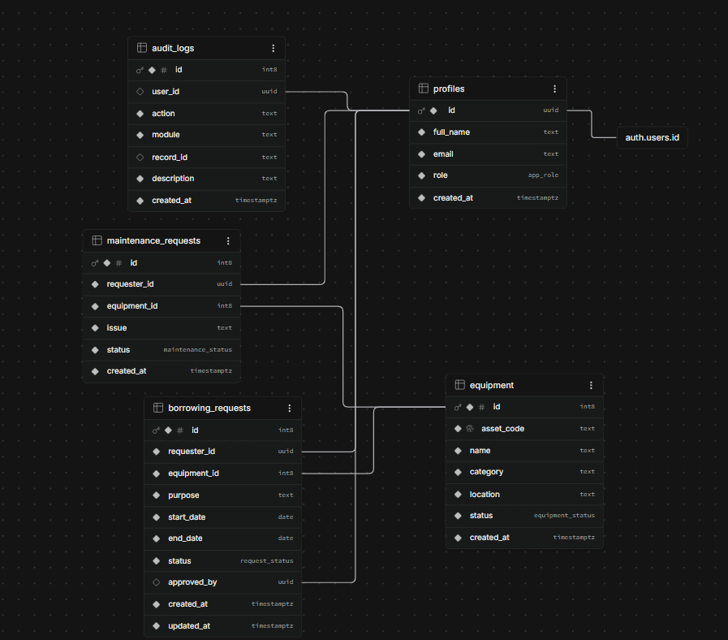
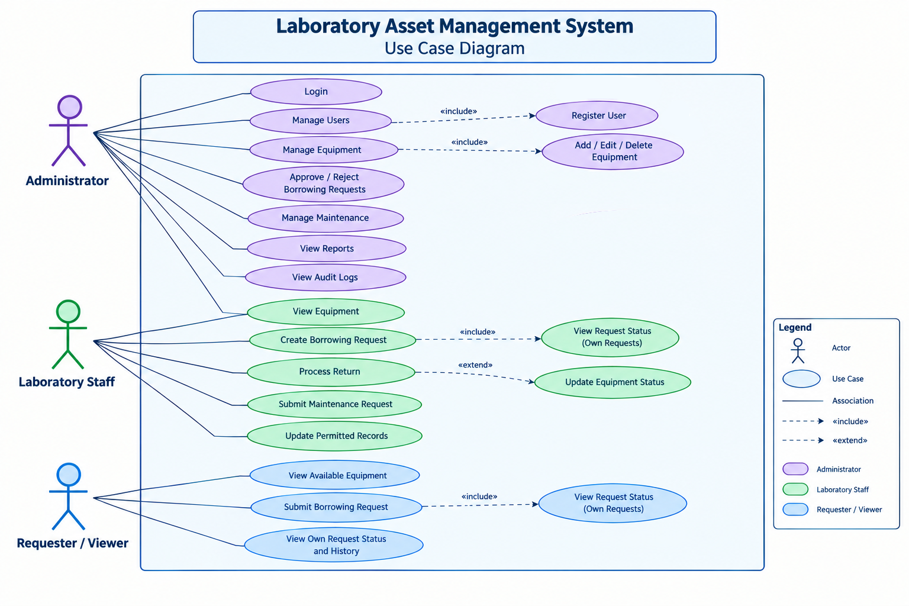
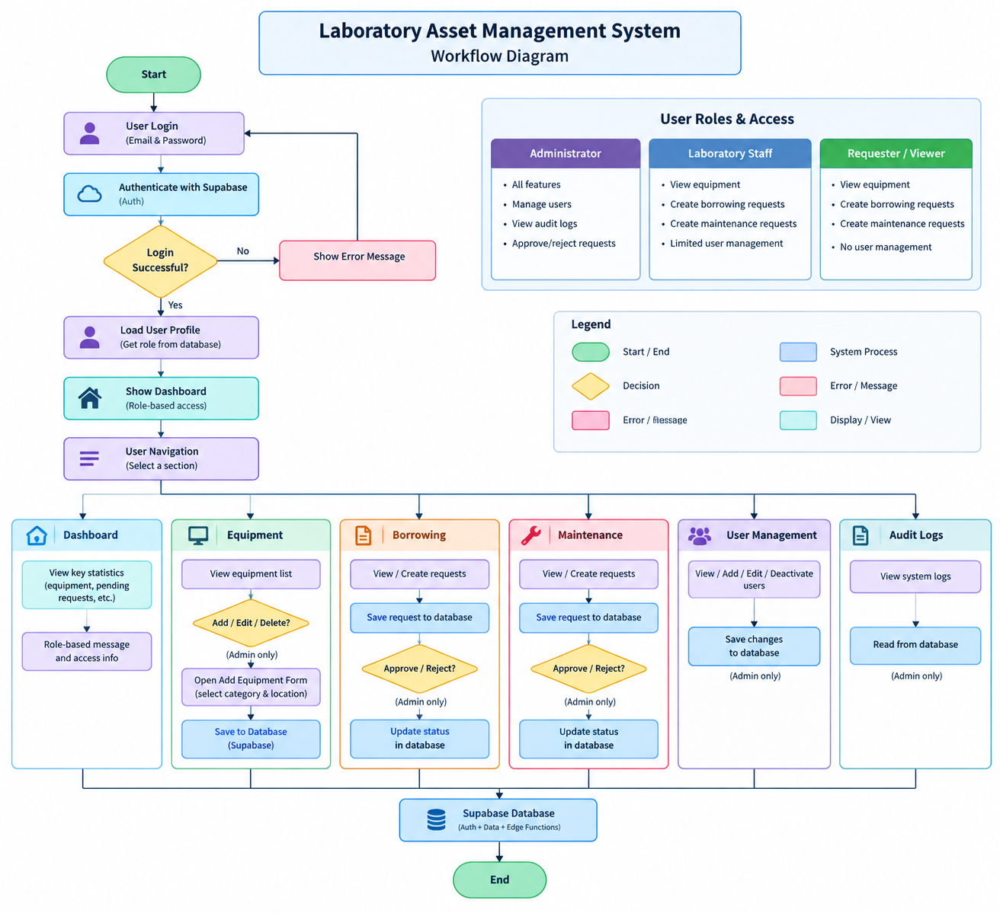
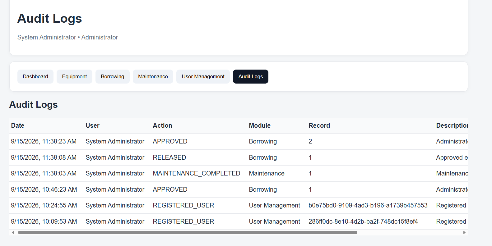

# Laboratory 4 - Asset Transaction and Approval Management

This project follows Laboratory 4 Section A: Role-Based Asset Transaction and Approval Management.

The system is a web-based Laboratory Asset Management System designed to manage laboratory equipment, borrowing requests, returns, maintenance requests, user roles, and system activities.

## Roles

- **Administrator** — registers and views users, manages equipment, approves or rejects borrowing requests, manages maintenance, and views reports and audit logs.
- **Laboratory Staff** — views equipment, creates borrowing transactions, processes returns, submits maintenance requests, and updates permitted records.
- **Requester / Viewer** — views available equipment, submits borrowing requests, and views their own request status and history.

## Important Registration Rule

There is **no public Sign Up button**.

Only an **Administrator** can register new users from the **User Management** section.

The first Administrator must be created once through Supabase Authentication. After the first Administrator account is connected to the system profile, the Administrator can register the other user accounts.

---

# 1. System Overview

The Laboratory Asset Management System provides role-based access to laboratory asset and transaction functions.

The system supports:

- User authentication
- Role-based access control
- Laboratory equipment management
- Borrowing requests
- Borrowing approval and rejection
- Equipment release
- Equipment returns
- Maintenance requests
- Maintenance processing
- Reports
- Audit logs
- User registration by the Administrator

The system uses **GitHub Pages** for the web interface and **Supabase** for authentication, database management, row-level security, and server-side functions.

---

# 2. Role-Based Access

The system provides different functions depending on the user's assigned role.

### Administrator

The Administrator has access to administrative functions such as:

- Register users
- View registered users
- Add equipment
- Edit equipment
- Delete equipment
- Approve borrowing requests
- Reject borrowing requests
- Release approved equipment
- Manage maintenance requests
- View reports
- View audit logs

### Laboratory Staff

Laboratory Staff can:

- View equipment
- Create borrowing transactions
- Process equipment returns
- Submit maintenance requests
- Update permitted records

### Requester / Viewer

Requester / Viewer users can:

- View available equipment
- Submit borrowing requests
- View their own request status
- View their own request history

---

# 3. Updated ERD and Use Case Diagram

## Entity Relationship Diagram (ERD)

The updated ERD presents the main entities and relationships used by the Laboratory Asset Management System.

## Use Case Diagram

The Use Case Diagram presents the permitted functions of the Administrator, Laboratory Staff, and Requester / Viewer.

---

# 4. Role-Permission Matrix

| Function | Administrator | Laboratory Staff | Requester / Viewer |
|---|:---:|:---:|:---:|
| Login | ✓ | ✓ | ✓ |
| View Equipment | ✓ | ✓ | ✓ |
| Add Equipment | ✓ | — | — |
| Edit Equipment | ✓ | — | — |
| Delete Equipment | ✓ | — | — |
| Register Users | ✓ | — | — |
| View Users | ✓ | — | — |
| Create Borrowing Request | ✓ | ✓ | ✓ |
| Approve Borrowing Request | ✓ | — | — |
| Reject Borrowing Request | ✓ | — | — |
| Release Equipment | ✓ | — | — |
| Process Return | — | ✓ | — |
| Submit Maintenance Request | — | ✓ | — |
| Manage Maintenance | ✓ | — | — |
| Update Permitted Records | — | ✓ | — |
| View Reports | ✓ | — | — |
| View Audit Logs | ✓ | — | — |
| View Own Request Status | ✓ | ✓ | ✓ |
| View Own Request History | ✓ | ✓ | ✓ |
| Logout | ✓ | ✓ | ✓ |

Access to system functions is restricted according to the user's assigned role. Administrative functions are available only to the Administrator, while Laboratory Staff and Requester / Viewer users have access only to their permitted functions.

---

# 5. Workflow Diagram

The workflow shows the process of submitting, reviewing, approving or rejecting, releasing, and returning laboratory equipment.

## Borrowing Request Workflow

The borrowing process follows these main states:

**Borrowing Request Submitted**

↓

**Pending**

↓

**Administrator Reviews Request**

↓

**Approved / Rejected**

### If Rejected

**Rejected**

↓

**Request Cannot Be Released**

↓

**End**

### If Approved

**Approved**

↓

**Release Equipment**

↓

**Released**

↓

**Equipment Status = Borrowed**

↓

**Return Equipment**

↓

**Returned**

↓

**Equipment Status = Available**

↓

**Closed**

If returned equipment is damaged, it may instead require maintenance before becoming available again.

---

# 6. Business Rules

The following business rules control the borrowing, return, maintenance, and authorization processes of the system.

1. Only equipment with an **Available** status may be requested for borrowing.

2. Equipment with a **Maintenance** status cannot be borrowed.

3. Laboratory Staff cannot approve their own borrowing request.

4. Only the **Administrator** can approve or reject borrowing requests.

5. Only requests with a **Pending** status can be approved or rejected.

6. Only an **Approved** request can be released.

7. A rejected borrowing request cannot be released.

8. When equipment is released, its status changes to **Borrowed**.

9. When borrowed equipment is returned, its status changes to **Available**, unless the equipment requires maintenance.

10. A returned transaction cannot be processed for return again.

11. Only authorized users can access functions assigned to their role.

12. Only the **Administrator** can register new user accounts.

13. The Administrator can view registered users through the User Management section.

14. Important system activities must be recorded in the audit logs.

15. Users must be authenticated before accessing protected system functions.

16. Administrator-only functions must not be accessible to Laboratory Staff or Requester / Viewer users.

17. The system must prevent unauthorized operations even if a user attempts to access a restricted function directly.

---

# 7. Audit-Log Screenshot

The Audit Logs page allows the Administrator to view recorded system activities.

The audit log displays information including:

- Date
- User
- Action
- Module
- Record
- Description

The audit trail provides traceability for important activities performed in the system, such as borrowing approvals, equipment releases, maintenance completion, and user registration.

---

# 8. Functional Test Results

The following test cases are used to verify the role restrictions, borrowing workflow, equipment status changes, maintenance functions, and audit logging of the system.

| No. | Test Case | Expected Result | Actual Result | Status |
|---|---|---|---|:---:|
| 1 | Login as Administrator | Administrator functions are displayed | Administrator functions displayed | PASS |
| 2 | Login as Laboratory Staff | Staff functions are displayed | Staff functions displayed | PASS |
| 3 | Login as Requester / Viewer | Viewer functions are displayed | Viewer functions displayed | PASS |
| 4 | Requester / Viewer attempts to access Administrator functions | Access is denied | Access denied | PASS |
| 5 | Laboratory Staff creates a borrowing request | Request is saved with Pending status | Request saved as Pending | PASS |
| 6 | Administrator approves a Pending request | Request becomes Approved and action is recorded | Request approved and recorded | PASS |
| 7 | Administrator rejects a Pending request | Request becomes Rejected | Request rejected | PASS |
| 8 | Attempt to release a Rejected request | Release is blocked | Release blocked | PASS |
| 9 | Administrator releases an Approved request | Equipment becomes Borrowed | Equipment became Borrowed | PASS |
| 10 | Laboratory Staff processes a return | Equipment becomes Available | Equipment became Available | PASS |
| 11 | Administrator views Audit Logs | Recorded activities are displayed | Audit records displayed | PASS |
| 12 | Laboratory Staff attempts a restricted Administrator operation | Operation is blocked | Operation blocked | PASS |
| 13 | User logs out and accesses a protected page | Access is denied | Access denied | PASS |
| 14 | Laboratory Staff submits a maintenance request | Maintenance request is recorded | Maintenance request recorded | PASS |
| 15 | Administrator completes a maintenance request | Maintenance action is recorded | Maintenance action recorded | PASS |
| 16 | Administrator registers a new user | New user account is created and activity is logged | User registered and activity logged | PASS |

---

# Conclusion

The Laboratory Asset Management System implements role-based access control and a controlled asset transaction workflow.

The Administrator is responsible for administrative operations, approval and rejection of borrowing requests, equipment management, maintenance management, reports, audit logs, and user registration.

Laboratory Staff can perform permitted laboratory transactions such as creating borrowing transactions, processing returns, submitting maintenance requests, and updating permitted records.

Requester / Viewer users can view available equipment, submit borrowing requests, and monitor their own request status and history.

The system also records important activities through audit logs to provide traceability and support accountability for sensitive operations.
